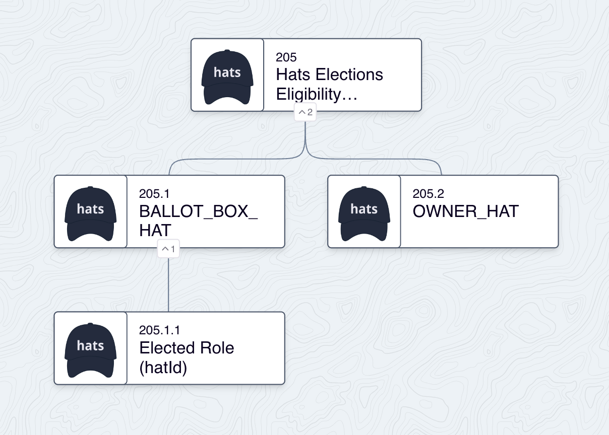

# Hats Elections Eligibility

A Hats Protocol eligibility module for elections.

## Overview and Usage

This contract is an Eligibility Module for Hats Protocol. It receives the results of an election conducted elsewhere (eg another smart contract, or offchain) and sets the winning addresses as eligible to wear a specified hat for the course of a specified term. It can also receive the results of a recall election, which sets the recalled addresses as ineligible to wear the hat.

### Roles and Configuration

This module operates on and with three roles, all represented by hats:

- **Elected Role (hatId)**: The role that is elected by the election. The hat for this role is specified by the `hatId` constant set upon deployment of a module instance. This is the hat that `getWearerStatus()` for which eligibility is determined, provided that the module instance is set as the eligibility module for the hat.

- **Ballot Box**: The submitter of election results. The hat for this role is specified by the `BALLOT_BOX_HAT` constant set upon deployment of a module instance. Only the wearer(s) of this hat are authorized to call `elect()` and `recall()`.

- **Owner**: This role is responsible for setting the current and next election terms. The hat for this role is specified by the `OWNER_HAT` constant set upon deployment of a module instance. Only wearer(s) of this hat are authorized to call `setNextTerm()`.

The only other configuration required is the first term's end date.


*An example Hats tree using Hats Elections Eligibility. Note that `BALLOT_BOX_HAT`, `OWNER_HAT`, and `hatId` are not required to be in this configuration.*

### Elections

This module is designed to work with elections that are conducted elsewhere. Election results are submitted by calling `elect()`, with arguments for the relevant term and an array of winning addresses.

Only the wearer(s) of the `BALLOT_BOX_HAT` are authorized to call `elect()`. "Ballot box" is our label for the contract that submits the election results. If the election is conducted onchain, then the ballot box is likely the election conrtact itself. If the election is conducted offchain, then the ballot box is likely an oracle contract.

There are a couple other restrictions on `elect()`:

- It cannot be called twice for the same term (see [Terms](#terms) below for more detail on terms).
- The number of winning addresses must be no greater than the maxSupply of the hat representing the elected role.

### Recall Elections

The inverse of an election is a recall election, where one or more of the elected addresses are recalled, i.e. removed from the role they were elected to. In this contract, recall elections are conducted by calling `recall()`, with arguments for the relevant term and an array of recalled addresses.

Only the wearer(s) of the `BALLOT_BOX_HAT` are authorized to call `recall()`. 

Recall elections can take place at any time, with no restriction.

### Terms

When an election is conducted, the winning addresses are set as eligible to wear the hat for a specified period of time, i.e. a "term." 

In this contract, a term is defined and identified by the uint128 unix timestamp of its end date. For gas optimization reasons, the timestamp actually used is the timestampe of the second immediately *following* the end of the term.

This module keeps track of two terms: the current term (`currentTermEnd`) and the next term (`nextTermEnd`).

The current term is the term that is currently in effect. The initial term is set when an instance of this module is deployed. Thereafter, wearer(s) of the `OWNER_HAT` can call `setNextTerm()` to set the next term. 

When the current term ends and the next term's election results have been submitted, the next term begins once anybody calls the poke function `startNextTerm()`.

### Eligibility and `getWearerStatus()`

Hats Protocol Eligibility Modules are contracts that adhere to the `IHatsEligibility` interface, which defines a single function:

```solidity
function getWearerStatus(address wearer, uint256 hatId) external view returns (bool eligible, bool standing);
```

This module doesn't touch on `standing`, and will always return true for `standing`. If desired, this module can be chained with other eligibility modules that do have `standing` logic. 

Accounts are eligible if they are elected for the current term. In other words, `getWearerStatus()` will return `eligible=true` for an account when the current term has not ended, and the account has been elected (and not recalled) for the current term. 

As soon as the term ends, all accounts elected for that term will immediately cease to be eligible.

## Development

This repo uses Foundry for development and testing. To get started:

1. Fork the project
2. Install [Foundry](https://book.getfoundry.sh/getting-started/installation)
3. To install dependencies, run `forge install`
4. To compile the contracts, run `forge build`
5. To test, run `forge test`

### IR-Optimized Builds

This repo also supports contracts compiled via IR. Since compiling all contracts via IR would slow down testing workflows, we only want to do this for our target contract(s), not anything in this `test` or `script` stack. We accomplish this by pre-compiled the target contract(s) and then loading the pre-compiled artifacts in the test suite.

First, we compile the target contract(s) via IR by running`FOUNDRY_PROFILE=optimized forge build` (ensuring that FOUNDRY_PROFILE is not in our .env file)

Next, ensure that tests are using the `DeployOptimized` script, and run `forge test` as normal.

See the wonderful [Seaport repo](https://github.com/ProjectOpenSea/seaport/blob/main/README.md#foundry-tests) for more details and options for this approach.
